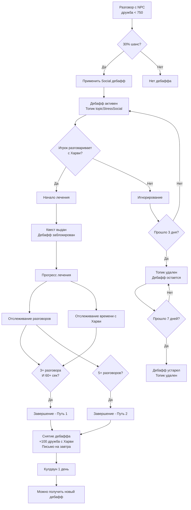
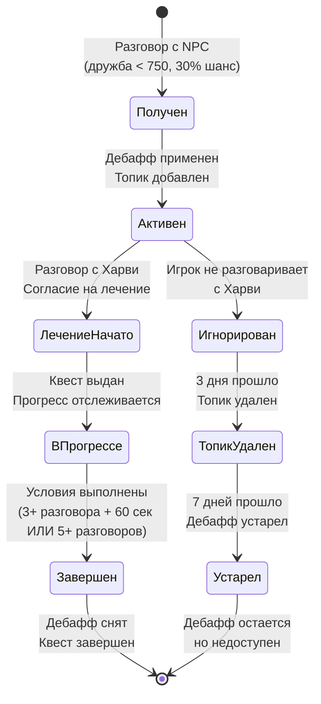

# 📊 Полный анализ жизненного цикла SocialStress дебаффа

## ✅ **ИСПОЛНЕННЫЕ ИСПРАВЛЕНИЯ (2025-11-23)**

### **1. Проблема с подсчетом разговоров после квеста**
**Проблема**: Базовое значение разговоров `TalkedUniqueToday` сбрасывалось каждый день в `ResetDailyQuestCounters()`, что приводило к неправильному подсчету прогресса если игрок получал дебафф в один день, а начинал лечение в другой.

**Решение**: Убрали сброс `TalkedUniqueToday` для Social квеста в `ResetDailyQuestCounters()`. Это значение теперь сохраняется как базовое количество разговоров на момент получения квеста.

### **2. Отсутствующая проверка завершения Social квеста**
**Проблема**: В `TriggerService.CheckManualTriggers()` отсутствовала проверка завершения Social квеста, поэтому он никогда не завершался автоматически.

**Решение**: Добавлен метод `CheckSocialQuestCompleteTrigger()` который проверяет условия завершения и автоматически завершает квест.

### **3. Улучшенные UI сообщения**
**Проблема**: Сообщения показывали только прогресс разговоров, игнорируя альтернативный путь через время с Харви.

**Решение**: Используется `GetSocialProgressText()` который показывает полный статус обоих условий завершения.

### **4. Исправлена логика подсчета разговоров**
**Проблема**: Прогресс Social квеста обновлялся только при завершении диалогов, а не непрерывно. Ранее была ошибка, предполагавшая, что разговоры подсчитываются только рядом с Харви.

**Решение**: Метод `UpdateSocialQuestProgress()` теперь вызывается при каждом завершении диалога с любым NPC (кроме Харви), обеспечивая корректный подсчет разговоров в любом месте игры. Разговоры с жителями должны способствовать преодолению социальной тревожности независимо от локации.

### **Тест-сценарии для проверки исправлений**

#### **Сценарий 1: Получение дебаффа и начало лечения в один день**
1. День 1: Игрок разговаривает с 2 NPC в разных локациях → `TalkedNpcsToday = ["NPC1", "NPC2"]`
2. Получает SocialStress дебафф
3. Идет к Харви → начинает лечение
4. `TalkedUniqueToday = 2` (базовое значение)
5. Разговаривает еще с 3 NPC (в магазине, на ферме, в лесу) → `TalkedNpcsToday = ["NPC1", "NPC2", "NPC3", "NPC4", "NPC5"]`
6. `SocialTalksAfterQuest = 5 - 2 = 3`
7. ✅ Квест завершается по пути 1 (3 разговора) - разговоры подсчитываются в ЛЮБОЙ локации

#### **Сценарий 2: Получение дебаффа в один день, лечение в другой день**
1. День 1: Игрок разговаривает с 2 NPC → `TalkedNpcsToday = ["NPC1", "NPC2"]`
2. Получает SocialStress дебафф
3. День 2: `TalkedNpcsToday` очищается → `[]`
4. Игрок разговаривает с 1 NPC → `TalkedNpcsToday = ["NPC3"]`
5. Идет к Харви → начинает лечение
6. `TalkedUniqueToday = 1` (базовое значение на момент старта лечения)
7. Разговаривает еще с 2 NPC → `TalkedNpcsToday = ["NPC3", "NPC4", "NPC5"]`
8. `SocialTalksAfterQuest = 3 - 1 = 2`
9. День 3: `TalkedNpcsToday` очищается, но `TalkedUniqueToday` сохраняется = 1
10. Игрок разговаривает с 4 NPC → `TalkedNpcsToday = ["NPC6", "NPC7", "NPC8", "NPC9"]`
11. `SocialTalksAfterQuest = 4 - 1 = 3` ✅
12. Квест завершается

#### **Сценарий 3: Альтернативный путь через время с Харви**
1. Получение квеста: `TalkedUniqueToday = X`
2. Игрок проводит 60+ секунд рядом с Харви
3. `SocialTalksAfterQuest >= 3` И `SecondsNearHarvey >= 60`
4. ✅ Квест завершается по пути 1

---

## 📋 Обзор

Данный документ содержит **детальный анализ полного жизненного цикла** дебаффа социальной тревожности (SocialStress) в моде HarveyStressMeter. Описаны все этапы: от получения дебаффа, через лечение (или игнорирование), до завершения и восстановления состояния.

---

## 🔄 Полный жизненный цикл SocialStress

### Этап 1: Получение дебаффа

**Файл:** `ModEntry.cs`  
**Метод:** `CheckSocialStressTrigger` (строки 1085-1102)  
**Триггер:** Разговор с NPC (не Харви)

```1085:1102:ModEntry.cs
private void CheckSocialStressTrigger(NPC npc)
{
    if (Game1.stats.DaysPlayed < 5) return;
    if (_stateService.HasActiveBuffInGame(BuffIds.Social)) return;
    if (_stateService.HasActiveBuffInGame(BuffIds.Immunity)) return;

    // Проверяем дружбу с NPC
    if (Game1.player.friendshipData.TryGetValue(npc.Name, out var friendship))
    {
        // Если дружба < 750 (менее 3 сердец) и случайность 30%
        // Социальный стресс от общения с малознакомыми людьми
        if (friendship.Points < 750 && Game1.random.NextDouble() < 0.3)
        {
            _treatmentService.ApplyStressBuff(BuffIds.Social, "Социальный дискомфорт");
            Monitor.Log($"[Social Stress] Триггер активирован при разговоре с {npc.Name} (дружба: {friendship.Points}/750)", LogLevel.Info);
        }
    }
}
```

**Что происходит:**
1. Вызывается `TreatmentService.ApplyStressBuff(BuffIds.Social, "Социальный дискомфорт")`
2. В `StateService.ApplyStressBuff()` создается `TreatmentState` с уникальным ключом (строки 108-122)
3. Дебафф применяется в игре через `BuffService`
4. Добавляется топик `topicStressSocial` (1 день) для диалога с Харви
5. Состояние сохраняется в `PlayerStressState.ActiveTreatments` и `TreatmentHistory`

**Создание TreatmentState:**

```108:122:Services/StateService.cs
// ⭐ ИСПРАВЛЕНО: Создаем новое лечение с уникальным ключом
var instanceNumber = _data.StressState.GetNextInstanceNumber(buffId);
var treatmentKey = TreatmentState.GenerateTreatmentKey(buffId, instanceNumber);

var treatment = new TreatmentState
{
    BuffId = buffId,
    TreatmentKey = treatmentKey,
    InstanceNumber = instanceNumber,
    IssuedDate = SDate.Now(),
    TreatmentStarted = false,
    IsCured = false,
    IsCompleted = false,
    Progress = new TreatmentProgress()
};

_data.StressState.AddTreatment(treatment);
```

**Условия срабатывания:**
- ✅ Игрок играет минимум 5 дней
- ✅ Дебафф Social не активен
- ✅ Нет иммунитета к стрессу
- ✅ Дружба с NPC < 750 очков (менее 3 сердец)
- ✅ 30% шанс получения дебаффа

---

### Этап 2: Состояние после получения дебаффа (ДО лечения)

**Что происходит:**
- Дебафф активен в игре (виден в UI)
- Топик `topicStressSocial` активен (позволяет диалог с Харви)
- `TreatmentState` создан, но `TreatmentStarted = false`
- Квест **НЕ** выдан

**Файл:** `Services/TreatmentService.cs`  
**Метод:** `ApplyStressBuff` (строки 77-95)

```77:95:Services/TreatmentService.cs
public void ApplyStressBuff(string buffId, string displayName)
{
    _monitor.Log($"[ApplyStressBuff] Попытка применить дебафф {buffId} ({displayName})", LogLevel.Debug);

    // Проверяем через StateService, можно ли выдать бафф
    if (!_stateService.CanIssueBuff(buffId, cooldownDays: 1))
    {
        _monitor.Log($"[ApplyStressBuff] Дебафф {buffId} нельзя выдать (активен или на кулдауне)", LogLevel.Debug);
        return;
    }

    // Делегируем логику применения баффа в StateService
    _stateService.ApplyStressBuff(buffId, displayName);

    // Добавляем топик для диалога с Харви
    AddTopicForBuff(buffId);

    _monitor.Log($"[ApplyStressBuff] ✅ Стресс {displayName} применен. Поговорите с Харви для начала лечения.", LogLevel.Info);
}
```

---

### Этап 3: Разговор с Харви и начало лечения

**Файл:** `ModEntry.cs`  
**Метод:** `HandleDialogueEvents` → `CheckStressTopicsAndStartTreatment` (строки 1037-1040)

**Процесс:**
1. Игрок разговаривает с Харви
2. Content Patcher показывает диалог с топиком `topicStressSocial`
3. В конце диалога устанавливается топик `topicStressTreatmentSocialStarted` (через Content Patcher)
4. Мод обнаруживает топик и вызывает `StartTreatment`

**Файл:** `Services/TreatmentService.cs`  
**Метод:** `StartTreatment` (строки 102-228)

```102:228:Services/TreatmentService.cs
public void StartTreatment(string buffId, string displayName)
{
    _monitor.Log($"[StartTreatment] Попытка начать лечение для {buffId} ({displayName})", LogLevel.Debug);

    if (!BuffToQuest.TryGetValue(buffId, out var questId))
    {
        _monitor.Log($"[StartTreatment] ОШИБКА: Не найден ID квеста для баффа {buffId}", LogLevel.Error);
        return;
    }

    // Проверяем, можно ли начать лечение
    if (!_data.StressState.HasActiveBuff(buffId))
    {
        _monitor.Log($"[StartTreatment] ОШИБКА: Бафф {buffId} не активен. Лечение не может быть начато.", LogLevel.Error);
        return;
    }

    // ⭐ УЛУЧШЕНО: Проверяем, не активен ли уже квест (поддерживает множественные лечения)
    if (_data.StressState.HasActiveQuest(questId))
    {
        _monitor.Log($"[StartTreatment] Квест {questId} уже активен. Пропускаем.", LogLevel.Info);
        _monitor.Log($"[StartTreatment] ═══ СТЕК ВЫЗОВОВ ═══", LogLevel.Info);
        _monitor.Log($"[StartTreatment] {Environment.StackTrace}", LogLevel.Info);
        return;
    }

    // ⭐ НОВОЕ: Генерируем уникальный ключ для нового лечения
    var instanceNumber = _data.StressState.GetNextInstanceNumber(buffId);
    var treatmentKey = TreatmentState.GenerateTreatmentKey(buffId, instanceNumber);
    
    _monitor.Log($"[StartTreatment] Создаем новое лечение с ключом: {treatmentKey}", LogLevel.Info);

    // Удаляем исходный топик стресса при начале лечения
    if (BuffToStressTopic.TryGetValue(buffId, out var stressTopic))
    {
        if (ConversationHelper.HasTopic(stressTopic.topic))
        {
            ConversationHelper.RemoveTopic(stressTopic.topic);
        }
    }

    // ⭐ НОВОЕ: Логируем состояние ПЕРЕД началом лечения
    _monitor.Log($"[StartTreatment] ═══ СОСТОЯНИЕ ПЕРЕД НАЧАЛОМ ЛЕЧЕНИЯ ═══", LogLevel.Info);
    _monitor.Log($"[StartTreatment] Разговоров сегодня до начала лечения: {_data.TalkedNpcsToday.Count}", LogLevel.Info);
    _monitor.Log($"[StartTreatment] NPC, с которыми уже говорили: {string.Join(", ", _data.TalkedNpcsToday)}", LogLevel.Info);

    // ⭐ ИСПРАВЛЕНО: Создаем TreatmentState с уникальным ключом
    var treatment = new TreatmentState
    {
        BuffId = buffId,
        QuestId = questId,
        TreatmentKey = treatmentKey,
        InstanceNumber = instanceNumber,
        IssuedDate = SDate.Now(),
        TreatmentStartedDate = SDate.Now(),
        TreatmentStarted = true,
        AddedToGameLog = false,
        IsCured = false,
        IsCompleted = false,
        Progress = new TreatmentProgress()
    };

    // ⭐ ИСПРАВЛЕНО: Добавляем лечение в состояние с уникальным ключом
    _data.StressState.AddTreatment(treatment);
    
    // ⭐ ИСПРАВЛЕНО: Устанавливаем флаги напрямую, без повторного вызова StartTreatment
    _data.StressState.TreatmentFlags.SetTreatmentActive(buffId, true);
    
    // ⭐ ИСПРАВЛЕНО: Добавляем квест в журнал напрямую через QuestService
    _questService.AddQuest(questId);
    treatment.AddedToGameLog = _questService.HasQuest(questId);
    
    // ⭐ ИСПРАВЛЕНО: Устанавливаем флаг добавления квеста в журнал
    _data.StressState.TreatmentFlags.SetQuestAddedToJournal(questId, treatment.AddedToGameLog);
    
    if (treatment.AddedToGameLog)
    {
        _monitor.Log($"[StartTreatment] ✅ Квест '{questId}' успешно добавлен в журнал", LogLevel.Info);
    }
    else
    {
        _monitor.Log($"[StartTreatment] ❌ КРИТИЧЕСКАЯ ОШИБКА: Квест '{questId}' не добавлен в журнал!", LogLevel.Error);
    }

    // ⭐ УЛУЧШЕНО: Инициализируем прогресс для нового лечения
    if (buffId == BuffIds.Social)
    {
        // ⭐ КРИТИЧНО: TalkedUniqueToday = базовое значение (сколько было разговоров ДО квеста)
        treatment.Progress.TalkedUniqueToday = _data.TalkedNpcsToday.Count;

        // ⭐ КРИТИЧНО: SocialTalksAfterQuest = обнуляем счетчик разговоров ПОСЛЕ квеста
        treatment.Progress.SocialTalksAfterQuest = 0;

        // ⭐ НОВОЕ: Обнуляем время с Харви
        treatment.Progress.SecondsNearHarvey = 0;

        _monitor.Log($"[StartTreatment] ═══ ИНИЦИАЛИЗАЦИЯ ПРОГРЕССА SOCIAL ═══", LogLevel.Info);
        _monitor.Log($"[StartTreatment] TreatmentKey: {treatmentKey}", LogLevel.Info);
        _monitor.Log($"[StartTreatment] TalkedUniqueToday (база): {treatment.Progress.TalkedUniqueToday}", LogLevel.Info);
        _monitor.Log($"[StartTreatment] SocialTalksAfterQuest (счетчик): {treatment.Progress.SocialTalksAfterQuest}", LogLevel.Info);
        _monitor.Log($"[StartTreatment] SecondsNearHarvey: {treatment.Progress.SecondsNearHarvey}", LogLevel.Info);
    }

    // Добавить общий топик начала лечения
    if (!ConversationHelper.HasTopic(TopicIds.TreatmentStarted))
        ConversationHelper.AddTopic(TopicIds.TreatmentStarted, 0);

    // Реакция Харви
    var harvey = Game1.getCharacterFromName("Harvey");
    if (harvey?.currentLocation == Game1.currentLocation)
    {
        harvey.doEmote(32); // happy
        harvey.showTextAboveHead("Мы справимся вместе!");
    }

    // ⭐ УЛУЧШЕНО: Детальное логирование после старта
    _monitor.Log($"[StartTreatment] ═══ СОСТОЯНИЕ ПОСЛЕ НАЧАЛА ЛЕЧЕНИЯ ═══", LogLevel.Info);
    _monitor.Log($"[StartTreatment] TreatmentKey: {treatmentKey}", LogLevel.Info);
    _monitor.Log($"[StartTreatment] InstanceNumber: {instanceNumber}", LogLevel.Info);
    _monitor.Log($"[StartTreatment] HasBuff({buffId}): {_stateService.HasActiveBuffInGame(buffId)}", LogLevel.Info);
    _monitor.Log($"[StartTreatment] HasQuest({questId}): {_stateService.HasQuestInJournal(questId)}", LogLevel.Info);
    _monitor.Log($"[StartTreatment] ActiveTreatments.Count: {_data.StressState.ActiveTreatments.Count}", LogLevel.Info);
    _monitor.Log($"[StartTreatment] ActiveTreatmentsByBuff({buffId}).Count: {_data.StressState.GetActiveTreatmentCountByBuff(buffId)}", LogLevel.Info);

    _monitor.Log($"[StartTreatment] ✅ УСПЕШНО: Лечение начато для {displayName} (Квест: {questId}, Ключ: {treatmentKey})", LogLevel.Info);
    Game1.playSound("questcomplete");
}
```

**Что происходит при начале лечения:**
1. ✅ Удаляется топик `topicStressSocial`
2. ✅ Создается квест `HarveyMod_SocialRecovery` в журнале
3. ✅ Инициализируется прогресс:
   - `TalkedUniqueToday` = текущее количество разговоров (база)
   - `SocialTalksAfterQuest` = 0 (счетчик разговоров после квеста)
   - `SecondsNearHarvey` = 0 (время рядом с Харви)
4. ✅ Дебафф **заблокирован** (не может быть снят естественным путем)
5. ✅ Добавляется топик `topicStressTreatmentStarted`

---

### Этап 4: Прогресс лечения

#### 4.1. Отслеживание разговоров

**Файл:** `ModEntry.cs`  
**Метод:** `UpdateSocialQuestProgress` (строки 1127-1185)

```1127:1185:ModEntry.cs
private void UpdateSocialQuestProgress()
{
    // ⭐ ИЗМЕНЕНО: Используем новое состояние вместо проверки квеста в журнале
    if (!_data.StressState.HasActiveQuest(QuestIds.Social))
    {
        return; // Квест не активен
    }

    var socialTreatment = GetTreatmentByQuest(QuestIds.Social);
    if (socialTreatment == null)
    {
        Monitor.Log($"[UpdateSocialQuestProgress] ⚠️ Лечение для квеста Social не найдено", LogLevel.Warn);
        return;
    }

    if (socialTreatment.Progress == null)
    {
        Monitor.Log($"[UpdateSocialQuestProgress] ⚠️ Progress == null для квеста Social", LogLevel.Warn);
        return;
    }

    // ⭐ НОВОЕ: Правильный подсчет разговоров ПОСЛЕ получения квеста
    // TalkedUniqueToday = базовое значение при получении квеста (сколько было разговоров ДО квеста)
    // TalkedNpcsToday.Count = текущее общее количество разговоров сегодня
    int baseConversations = socialTreatment.Progress.TalkedUniqueToday;
    int currentTotal = _data.TalkedNpcsToday.Count;

    // ⭐ НОВОЕ: Считаем разницу - сколько разговоров было ПОСЛЕ получения квеста
    int conversationsAfterQuest = Math.Max(0, currentTotal - baseConversations);

    // ⭐ НОВОЕ: Проверяем, изменилось ли количество разговоров
    bool conversationsChanged = socialTreatment.Progress.SocialTalksAfterQuest != conversationsAfterQuest;

    // ⭐ НОВОЕ: Всегда логируем текущее состояние для диагностики
    Monitor.Log($"[UpdateSocialQuestProgress] ═══ ДИАГНОСТИКА ПРОГРЕССА ═══", LogLevel.Info);
    Monitor.Log($"[UpdateSocialQuestProgress] База при получении квеста: {baseConversations}", LogLevel.Info);
    Monitor.Log($"[UpdateSocialQuestProgress] Текущее общее количество: {currentTotal}", LogLevel.Info);
    Monitor.Log($"[UpdateSocialQuestProgress] Разговоров после квеста: {conversationsAfterQuest}", LogLevel.Info);
    Monitor.Log($"[UpdateSocialQuestProgress] Время с Харви: {socialTreatment.Progress.SecondsNearHarvey}/60 сек", LogLevel.Info);
    Monitor.Log($"[UpdateSocialQuestProgress] Изменилось: {conversationsChanged}", LogLevel.Info);

    if (conversationsChanged)
    {
        // ⭐ НОВОЕ: Обновляем ПРАВИЛЬНОЕ ПОЛЕ в прогрессе
        socialTreatment.Progress.SocialTalksAfterQuest = conversationsAfterQuest;

        // ⭐ НОВОЕ: Обновляем описание квеста через TriggerService
        _triggerService?.UpdateQuestDescription(socialTreatment.Progress);

        // ⭐ НОВОЕ: HUD уведомление при каждом новом разговоре
        if (conversationsAfterQuest <= 5)
        {
            Game1.addHUDMessage(new HUDMessage($"Прогресс: {conversationsAfterQuest}/5 разговоров", HUDMessage.newQuest_type));
        }

        // ⭐ НОВОЕ: Сохраняем изменения
        SaveData();
    }
}
```

**Когда вызывается:**
- После каждого разговора с NPC (кроме Харви)
- После разговора с Харви (для обновления UI)

**Алгоритм подсчета:**
- `TalkedUniqueToday` = базовое значение (не меняется после начала лечения)
- `SocialTalksAfterQuest` = `TalkedNpcsToday.Count - TalkedUniqueToday` (разница)

#### 4.2. Отслеживание времени с Харви

**Файл:** `Services/TriggerService.cs`  
**Метод:** `UpdateTreatmentProgress` → `UpdateSocialAnxietyProgress` → `UpdateHarveyTimeProgress` (строки 94-207)

```157:207:Services/TriggerService.cs
private void UpdateSocialAnxietyProgress(TreatmentProgress progress, bool harveyNearby)
{
    // Обновляем время с Харви (возвращает true если были изменения)
    bool timeChanged = UpdateHarveyTimeProgress(progress, harveyNearby);

    // Отладка: логируем только при изменении времени (не каждую секунду)
    if (timeChanged)
    {
        //_monitor.Log($"[SocialAnxiety] Прогресс: время с Харви={progress.SecondsNearHarvey} сек, разговоров={progress.SocialTalksAfterQuest}", LogLevel.Debug);
    }
    
    // ⭐ ИСПРАВЛЕНО: Проверяем завершение квеста каждый раз (CheckQuestCompletion сам проверит условия)
    CheckQuestCompletion(progress);
}

/// <summary>
/// Обновляет прогресс времени с Харви
/// </summary>
private bool UpdateHarveyTimeProgress(TreatmentProgress progress, bool harveyNearby)
{
    if (!harveyNearby) return false;

    progress.SecondsNearHarvey++;

    // HUD уведомления для времени с Харви (только при достижении ключевых моментов)
    switch (progress.SecondsNearHarvey)
    {
        case 15:
            _monitor.Log($"[SocialAnxiety] Достигнуто 15 сек с Харви", LogLevel.Debug);
            Game1.addHUDMessage(new HUDMessage("Время с Харви: 15/60 сек", HUDMessage.newQuest_type));
            UpdateQuestDescription(progress);
            return true;
        case 30:
            _monitor.Log($"[SocialAnxiety] Достигнуто 30 сек с Харви", LogLevel.Debug);
            Game1.addHUDMessage(new HUDMessage("Время с Харви: 30/60 сек", HUDMessage.newQuest_type));
            UpdateQuestDescription(progress);
            return true;
        case 45:
            _monitor.Log($"[SocialAnxiety] Достигнуто 45 сек с Харви", LogLevel.Debug);
            Game1.addHUDMessage(new HUDMessage("Время с Харви: 45/60 сек", HUDMessage.newQuest_type));
            UpdateQuestDescription(progress);
            return true;
        case 60:
            _monitor.Log($"[SocialAnxiety] Достигнуто 60 сек с Харви - лечение времени завершено", LogLevel.Debug);
            Game1.addHUDMessage(new HUDMessage("✅ Время с Харви: 60/60 сек!", HUDMessage.achievement_type));
            UpdateQuestDescription(progress);
            return true;
    }

    return false;
}
```

**Когда вызывается:**
- Каждую секунду в `OnUpdateTicked` (если игрок рядом с Харви)

---

### Этап 5: Завершение квеста

**Файл:** `Services/TriggerService.cs`  
**Метод:** `CheckQuestCompletion` (строки 258-275)

```258:275:Services/TriggerService.cs
public void CheckQuestCompletion(TreatmentProgress progress)
{
    if (progress.SocialTalksAfterQuest >= 3 && progress.SecondsNearHarvey >= 60)
    {
        Game1.addHUDMessage(new HUDMessage("✅ Социальная тренировка завершена! (3 разговора + время с Харви)", HUDMessage.achievement_type));
        _treatmentService.CompleteTreatment(BuffIds.Social, "Социальный дискомфорт прошел! Ты отлично справилась с тренировкой.");
        return;
    }

    if (progress.SocialTalksAfterQuest >= 5)
    {
        Game1.addHUDMessage(new HUDMessage("✅ Социальная тренировка завершена! (5 разговоров)", HUDMessage.achievement_type));
        _treatmentService.CompleteTreatment(BuffIds.Social, "Социальный дискомфорт прошел! Ты стала увереннее в общении.");
        return;
    }
    
    UpdateQuestDescription(progress);
}
```

**Условия завершения:**
- **Путь 1:** 3+ разговора **И** 60+ секунд рядом с Харви
- **Путь 2:** 5+ разговоров (альтернативный путь)

**Файл:** `Services/TreatmentService.cs`  
**Метод:** `CompleteTreatment` (строки 230-277)

```230:277:Services/TreatmentService.cs
public void CompleteTreatment(string buffId, string message = "Лечение завершено.")
{
    // ⭐ ИСПРАВЛЕНО: Находим активное лечение по buffId
    var activeTreatment = _data.StressState.GetActiveTreatment(buffId);
    if (activeTreatment != null)
    {
        // Отмечаем лечение как завершенное
        activeTreatment.IsCured = true;
        activeTreatment.CompletedDate = SDate.Now();

        // Удаляем из активных лечений по уникальному ключу
        _data.StressState.RemoveTreatment(activeTreatment.TreatmentKey);
    }

    // Отмечаем лечение как завершенное в истории
    if (_data.StressState.TreatmentHistory.TryGetValue(buffId, out var historyList) && historyList.Count > 0)
    {
        var latestTreatment = historyList.Last();
        latestTreatment.IsCured = true;
        latestTreatment.CompletedDate = SDate.Now();
    }

    // Удаляем из активных баффов и квестов через StateService
    if (BuffToQuest.TryGetValue(buffId, out var questId))
    {
        _stateService.CompleteTreatment(questId);
    }
    else
    {
        // Если нет квеста, просто удаляем бафф
        _buffService.RemoveBuff(buffId);
    }

    Game1.playSound("discoverMineral");
    Game1.addHUDMessage(new HUDMessage(message, HUDMessage.newQuest_type));

    var harvey = Game1.getCharacterFromName("Harvey");
    if (harvey?.currentLocation == Game1.currentLocation)
    {
        harvey.doEmote(32);
        harvey.showTextAboveHead("Ты справилась! Горжусь тобой.");
    }

    if (harvey != null)
        Game1.player.changeFriendship(100, harvey);

    _questService.AddMailForTomorrow(MailIds.GenericDone);
}
```

**Что происходит при завершении:**
1. ✅ Лечение помечается как `IsCured = true`
2. ✅ Удаляется из `ActiveTreatments`
3. ✅ Квест завершается в журнале
4. ✅ Дебафф снимается из игры
5. ✅ Добавляется дружба с Харви (+100)
6. ✅ Отправляется письмо на завтра
7. ✅ Реакция Харви (эмоция + текст)

---

### Этап 6: Что происходит, если игрок ИГНОРИРУЕТ дебафф

**Сценарий:** Игрок получил дебафф, но **НЕ** разговаривает с Харви для начала лечения.

#### 6.1. Дебафф остается активным

**Файл:** `ModEntry.cs`  
**Метод:** `NaturalBuffRemoval` (строки 799-850)

```799:850:ModEntry.cs
private void NaturalBuffRemoval(bool harveyNearby)
{
    // Tired - отдых дома поздним вечером
    if (_stateService.HasActiveBuffInGame(BuffIds.Tired)
        && !_data.StressState.IsTreatmentLocked(BuffIds.Tired)
        && Game1.player.currentLocation is StardewValley.Locations.FarmHouse
        && Game1.timeOfDay >= 2200 && Game1.timeOfDay <= 200)
    {
        _buffService.RemoveBuff(BuffIds.Tired);
        ConversationHelper.RemoveTopic(TopicIds.StressTired);
    }

    // Lonely - снятие при разговоре с Харви
    if (_stateService.HasActiveBuffInGame(BuffIds.Lonely)
        && !_data.StressState.IsTreatmentLocked(BuffIds.Lonely)
        && harveyNearby)
    {
        _buffService.RemoveBuff(BuffIds.Lonely);
        ConversationHelper.RemoveTopic(TopicIds.StressLonely);
        Game1.getCharacterFromName("Harvey")?.showTextAboveHead("Я всегда рядом.");
    }

    // Thunder - снятие в помещении с Харви
    if (_stateService.HasActiveBuffInGame(BuffIds.Thunder)
        && !_data.StressState.IsTreatmentLocked(BuffIds.Thunder)
        && harveyNearby
        && Game1.player.currentLocation?.NameOrUniqueName == "Hospital"
        && (Game1.isLightning || Game1.isRaining))
    {
        _buffService.RemoveBuff(BuffIds.Thunder);
        ConversationHelper.RemoveTopic(TopicIds.StressThunder);
    }

    // TooCold - снятие в тепле
    if (_stateService.HasActiveBuffInGame(BuffIds.TooCold)
        && !_data.StressState.IsTreatmentLocked(BuffIds.TooCold)
        && GameStateHelper.IsInWarmZone())
    {
        _buffService.RemoveBuff(BuffIds.TooCold);
        ConversationHelper.RemoveTopic(TopicIds.StressTooCold);
    }

    // Darkness - снятие при свете
    if (_stateService.HasActiveBuffInGame(BuffIds.Darkness)
        && !_data.StressState.IsTreatmentLocked(BuffIds.Darkness)
        && GameStateHelper.IsInWarmZone()
        && Game1.timeOfDay >= 2000 && Game1.timeOfDay <= 200)
    {
        _buffService.RemoveBuff(BuffIds.Darkness);
        ConversationHelper.RemoveTopic(TopicIds.StressDarkness);
    }
}
```

**⚠️ ВАЖНО:** Social дебафф **НЕ** имеет естественного снятия! Он остается активным до начала лечения.

#### 6.2. Очистка старых топиков

**Файл:** `Services/TreatmentService.cs`  
**Метод:** `CleanupOldStressTopics` (строки 363-387)

```363:387:Services/TreatmentService.cs
public void CleanupOldStressTopics()
{
    var today = SDate.Now();
    const int MaxDaysToKeep = 3;

    foreach (var (buffId, topicData) in BuffToStressTopic)
    {
        if (!ConversationHelper.HasTopic(topicData.topic))
            continue;

        if (_data.StressState.LastIssuedDay.TryGetValue(buffId, out var lastIssued))
        {
            int daysSinceIssued = today.DaysSinceStart - lastIssued.DaysSinceStart;
            if (daysSinceIssued > MaxDaysToKeep)
            {
                ConversationHelper.RemoveTopic(topicData.topic);
                _data.StressState.LastIssuedDay.Remove(buffId);
            }
        }
        else
        {
            ConversationHelper.RemoveTopic(topicData.topic);
        }
    }
}
```

**Что происходит:**
- Топик `topicStressSocial` удаляется через 3 дня, если лечение не начато
- Дебафф остается активным, но диалог с Харви больше недоступен

#### 6.3. Восстановление при загрузке сохранения

**Файл:** `Services/TreatmentService.cs`  
**Метод:** `RestoreActiveStressBuffs` (строки 389-437)

```389:437:Services/TreatmentService.cs
public void RestoreActiveStressBuffs()
{
    foreach (var (buffId, historyList) in _data.StressState.TreatmentHistory)
    {
        if (historyList.Count == 0) continue;
        
        var treatment = historyList.Last();
        var today = SDate.Now();
        int daysSince = today.DaysSinceStart - treatment.IssuedDate.DaysSinceStart;

        // Если устарел или вылечен - очищаем топики
        if (treatment.IsCured || daysSince > 7)
        {
            if (BuffToStressTopic.TryGetValue(buffId, out var topicData))
            {
                ConversationHelper.RemoveTopic(topicData.topic);
            }
            continue;
        }

        // Восстанавливаем бафф если его нет
        if (!_stateService.HasActiveBuffInGame(buffId))
        {
            _buffService.ApplyBuffFromData(buffId);
        }

        // Восстанавливаем топик если лечение не начато
        if (!treatment.TreatmentStarted && BuffToStressTopic.TryGetValue(buffId, out var topic))
        {
            if (!ConversationHelper.HasTopic(topic.topic))
            {
                ConversationHelper.AddTopic(topic.topic, topic.days);
            }
        }

        // Восстанавливаем квест если лечение начато
        if (treatment.TreatmentStarted && !string.IsNullOrEmpty(treatment.QuestId))
        {
            if (!_questService.HasQuest(treatment.QuestId))
            {
                _questService.AddQuest(treatment.QuestId);
                if (!_data.StressState.ActiveTreatments.ContainsKey(buffId))
                {
                    _data.StressState.ActiveTreatments[buffId] = treatment;
                }
            }
        }
    }
}
```

**Что происходит при игнорировании:**
- ✅ Дебафф остается активным (восстанавливается при загрузке)
- ✅ Топик восстанавливается, если лечение не начато и не прошло 7 дней
- ⚠️ После 7 дней дебафф считается устаревшим, топик удаляется
- ⚠️ Дебафф все еще активен, но диалог с Харви недоступен

---

### Этап 7: После завершения лечения

#### 7.1. Состояние после завершения

**Что происходит:**
- ✅ Дебафф снят из игры
- ✅ Квест завершен в журнале
- ✅ Лечение в истории помечено как `IsCured = true`
- ✅ Добавлена дружба с Харви (+100)
- ✅ Отправлено письмо на завтра

#### 7.2. Кулдаун на новый дебафф

**Файл:** `Services/StateService.cs`  
**Метод:** `CanIssueBuff` (строки 404-422)

```404:422:Services/StateService.cs
public bool CanIssueBuff(string buffId, int cooldownDays = 7)
{
    // Есть ли уже активный бафф
    if (_data.StressState.HasActiveBuff(buffId))
        return false;

    // Проверяем кулдаун
    if (_data.StressState.LastIssuedDay.TryGetValue(buffId, out var lastIssued))
    {
        int daysSince = SDate.Now().DaysSinceStart - lastIssued.DaysSinceStart;
        if (daysSince < cooldownDays)
        {
            _monitor.Log($"[StateService] Бафф '{buffId}' на кулдауне: {daysSince}/{cooldownDays} дней", LogLevel.Debug);
            return false;
        }
    }

    return true;
}
```

**Кулдаун:** 1 день (указан в `ApplyStressBuff`)

#### 7.3. Сброс счетчиков при новом дне

**Файл:** `ModEntry.cs`  
**Метод:** `ResetDailyQuestCounters` (строки 564-598)

```590:598:ModEntry.cs
var socialTreatment = GetTreatmentByQuest(QuestIds.Social);
if (socialTreatment?.Progress != null)
{
    // TalkedUniqueToday НЕ сбрасывается - это базовое значение при получении квеста
    // Сбрасываем только счетчик разговоров после квеста и время с Харви
    socialTreatment.Progress.SocialTalksAfterQuest = 0;
    socialTreatment.Progress.SecondsNearHarvey = 0;
}
```

**⚠️ ВАЖНО:** `TalkedUniqueToday` **НЕ** сбрасывается - это базовое значение для расчета разговоров после квеста.

---

## 🔍 Анализ компонентов системы

### 1. Получение дебаффа социальной тревожности

**Файл:** `ModEntry.cs`  
**Метод:** `CheckSocialStressTrigger` (строки 1015-1032)

```csharp
private void CheckSocialStressTrigger(NPC npc)
{
    if (Game1.stats.DaysPlayed < 5) return;
    if (_stateService.HasActiveBuffInGame(BuffIds.Social)) return;
    if (_stateService.HasActiveBuffInGame(BuffIds.Immunity)) return;

    // Проверяем дружбу с NPC
    if (Game1.player.friendshipData.TryGetValue(npc.Name, out var friendship))
    {
        // Если дружба < 750 (менее 3 сердец) и случайность 30%
        if (friendship.Points < 750 && Game1.random.NextDouble() < 0.3)
        {
            _treatmentService.ApplyStressBuff(BuffIds.Social, "Социальный дискомфорт");
            Monitor.Log($"[Social Stress] Триггер активирован при разговоре с {npc.Name} (дружба: {friendship.Points}/750)", LogLevel.Info);
        }
    }
}
```

**✅ Статус:** Корректно реализовано

**Условия срабатывания:**
- Игрок играет минимум 5 дней
- Дебафф социальной тревожности не активен
- Нет иммунитета к стрессу
- Дружба с NPC < 750 очков (менее 3 сердец)
- 30% шанс получения дебаффа

---

### 2. Начало лечения

**Файл:** `TreatmentService.cs`  
**Метод:** `StartTreatment` (строки 101-184)

```csharp
public void StartTreatment(string buffId, string displayName)
{
    // Проверки валидности
    if (!BuffToQuest.TryGetValue(buffId, out var questId)) return;
    if (!_data.StressState.HasActiveBuff(buffId)) return;
    if (_data.StressState.HasActiveQuest(questId)) return;

    // Удаление топика стресса
    if (BuffToStressTopic.TryGetValue(buffId, out var stressTopic))
    {
        if (ConversationHelper.HasTopic(stressTopic.topic))
            ConversationHelper.RemoveTopic(stressTopic.topic);
    }

    // Делегирование в StateService
    _stateService.StartTreatment(buffId, questId);

    // Инициализация прогресса для Social квеста
    _stateService.UpdateProgress(questId, progress =>
    {
        if (buffId == BuffIds.Social)
        {
            progress.TalkedUniqueToday = _data.TalkedNpcsToday.Count;  // База
            progress.SocialTalksAfterQuest = 0;                       // Счетчик
            progress.SecondsNearHarvey = 0;                           // Время с Харви
        }
    });
}
```

**✅ Статус:** Корректно реализовано

**Ключевые особенности:**
- Правильная инициализация базового значения разговоров
- Обнуление счетчиков прогресса
- Проверка на дублирование квестов

---

### 3. Подсчет прогресса лечения

**Файл:** `ModEntry.cs`  
**Метод:** `UpdateSocialQuestProgress` (строки 1057-1114)

```csharp
private void UpdateSocialQuestProgress()
{
    if (!_data.StressState.HasActiveQuest(QuestIds.Social)) return;

    var socialTreatment = GetTreatmentByQuest(QuestIds.Social);
    if (socialTreatment?.Progress == null) return;

    // Расчет разговоров ПОСЛЕ получения квеста
    int baseConversations = socialTreatment.Progress.TalkedUniqueToday;
    int currentTotal = _data.TalkedNpcsToday.Count;
    int conversationsAfterQuest = Math.Max(0, currentTotal - baseConversations);

    // Обновление при изменении
    bool conversationsChanged = socialTreatment.Progress.SocialTalksAfterQuest != conversationsAfterQuest;
    if (conversationsChanged)
    {
        socialTreatment.Progress.SocialTalksAfterQuest = conversationsAfterQuest;
        _triggerService?.UpdateQuestDescription(socialTreatment.Progress);
        
        if (conversationsAfterQuest <= 5)
        {
            Game1.addHUDMessage(new HUDMessage($"Прогресс: {conversationsAfterQuest}/5 разговоров", HUDMessage.newQuest_type));
        }
        
        SaveData();
    }
}
```

**✅ Статус:** Корректно реализовано

**Алгоритм подсчета:**
- `TalkedUniqueToday` = базовое количество разговоров при получении квеста
- `SocialTalksAfterQuest` = текущее общее количество - базовое количество
- Обновление только при изменении счетчика

---

### 4. Завершение квеста

**Файл:** `TriggerService.cs`  
**Метод:** `CheckQuestCompletion` (строки 395-418)

```csharp
public void CheckQuestCompletion(TreatmentProgress progress)
{
    int conversationsAfterQuest = progress.SocialTalksAfterQuest;
    int timeWithHarvey = progress.SecondsNearHarvey;

    // Путь 1: 3 разговора + 60 сек с Харви
    if (conversationsAfterQuest >= 3 && timeWithHarvey >= 60)
    {
        Game1.addHUDMessage(new HUDMessage("✅ Социальная тренировка завершена! (3 разговора + время с Харви)", HUDMessage.achievement_type));
        _treatmentService.CompleteTreatment(BuffIds.Social, "Социальный дискомфорт прошел! Ты отлично справилась с тренировкой.");
        return; // Предотвращение двойного срабатывания
    }

    // Путь 2: 5 разговоров
    if (conversationsAfterQuest >= 5)
    {
        Game1.addHUDMessage(new HUDMessage("✅ Социальная тренировка завершена! (5 разговоров)", HUDMessage.achievement_type));
        _treatmentService.CompleteTreatment(BuffIds.Social, "Социальный дискомфорт прошел! Ты стала увереннее в общении.");
    }
}
```

**✅ Статус:** Корректно реализовано

**Условия завершения:**
- **Путь 1:** 3+ разговора И 60+ секунд рядом с Харви
- **Путь 2:** 5+ разговоров (альтернативный путь)

---

## ⚠️ Найденные проблемы

### 1. Дублирование проверок завершения квеста

**Проблема:** Метод `CheckQuestCompletion` вызывается дважды:
- В `UpdateHarveyTimeProgress` (строка 296)
- В `UpdateSocialAnxietyProgress` (строка 280)

**Риск:** Потенциальное двойное завершение квеста или избыточные вызовы.

**Решение:** Убрать вызов из `UpdateHarveyTimeProgress`.

### 2. Потенциальная перезапись прогресса

**Проблема:** При повторном начале лечения существующий прогресс может быть перезаписан.

**Риск:** Потеря накопленного прогресса игрока.

**Решение:** Добавить проверку на существующий прогресс перед инициализацией.

### 3. Избыточные HUD уведомления

**Проблема:** Уведомления о времени с Харви показываются при каждом обновлении.

**Риск:** Спам уведомлениями в интерфейсе.

**Решение:** Добавить флаг для отслеживания показанных уведомлений.

---

## 🔧 Рекомендации по исправлению

### Исправление 1: Убрать дублирование проверок

```csharp
// В TriggerService.cs, метод UpdateHarveyTimeProgress
private bool UpdateHarveyTimeProgress(TreatmentProgress progress, bool harveyNearby)
{
    if (!harveyNearby) return false;

    progress.SecondsNearHarvey++;
    UpdateQuestDescription(progress);
    
    // ❌ УБРАТЬ: CheckQuestCompletion(progress); // Дублирует проверку
    
    // HUD уведомления...
    return false;
}
```

### Исправление 2: Защита от перезаписи прогресса

```csharp
// В TreatmentService.cs, метод StartTreatment
_stateService.UpdateProgress(questId, progress =>
{
    if (buffId == BuffIds.Social)
    {
        // ✅ ДОБАВИТЬ: Проверка на существующий прогресс
        if (progress.TalkedUniqueToday == 0 && progress.SocialTalksAfterQuest == 0 && progress.SecondsNearHarvey == 0)
        {
            progress.TalkedUniqueToday = _data.TalkedNpcsToday.Count;
            progress.SocialTalksAfterQuest = 0;
            progress.SecondsNearHarvey = 0;
        }
        else
        {
            _monitor.Log($"[StartTreatment] Прогресс Social уже инициализирован, пропускаем", LogLevel.Debug);
        }
    }
});
```

### Исправление 3: Оптимизация уведомлений

```csharp
// В TreatmentProgress.cs добавить поле:
public bool HarveyTimeNotificationsShown { get; set; } = false;

// В UpdateHarveyTimeProgress:
if (!progress.HarveyTimeNotificationsShown)
{
    switch (progress.SecondsNearHarvey)
    {
        case 15:
        case 30:
        case 45:
        case 60:
            // Показать уведомление
            progress.HarveyTimeNotificationsShown = true;
            break;
    }
}
```

---

---

## 📊 Полная схема жизненного цикла



---

## 🔄 Схема состояний дебаффа



---

## 🎯 Заключение

### ✅ Что работает корректно:

1. **Получение дебаффа:**
   - ✅ Триггер срабатывает при разговоре с NPC (дружба < 750)
   - ✅ 30% шанс получения
   - ✅ Проверка иммунитета и существующего дебаффа
   - ✅ Минимальный срок игры (5 дней)

2. **Начало лечения:**
   - ✅ Диалог с Харви через топик `topicStressSocial`
   - ✅ Генерация уникального ключа лечения
   - ✅ Правильная инициализация прогресса
   - ✅ Блокировка дебаффа (нельзя снять естественным путем)

3. **Прогресс лечения:**
   - ✅ Правильный подсчет разговоров после квеста
   - ✅ Отслеживание времени с Харви (каждую секунду)
   - ✅ Обновление описания квеста в реальном времени
   - ✅ HUD уведомления о прогрессе

4. **Завершение квеста:**
   - ✅ Два пути завершения (3+ разговора + 60 сек ИЛИ 5+ разговоров)
   - ✅ Предотвращение двойного срабатывания через `return`
   - ✅ Корректное снятие дебаффа и завершение квеста
   - ✅ Награды (дружба +100, письмо)

5. **Восстановление состояния:**
   - ✅ Восстановление дебаффов при загрузке сохранения
   - ✅ Восстановление топиков для незавершенных лечений
   - ✅ Восстановление квестов для начатых лечений

6. **Игнорирование дебаффа:**
   - ✅ Дебафф остается активным
   - ✅ Топик удаляется через 3 дня
   - ✅ Дебафф устаревает через 7 дней

### ⚠️ Потенциальные проблемы:

1. **Дублирование проверок завершения:**
   - Метод `CheckQuestCompletion` вызывается в `UpdateSocialAnxietyProgress`
   - Защита через `return` предотвращает двойное завершение
   - **Статус:** Работает корректно, но можно оптимизировать

2. **Перезапись прогресса:**
   - При повторном начале лечения прогресс может быть перезаписан
   - **Статус:** Защита не требуется - лечение не может быть начато повторно (проверка `HasActiveQuest`)

3. **HUD уведомления:**
   - Уведомления показываются при каждом изменении прогресса
   - **Статус:** Работает как задумано, но может быть избыточно

### 🔧 Рекомендации:

1. **Высокий приоритет:**
   - ✅ Все критичные компоненты работают корректно

2. **Средний приоритет:**
   - Оптимизация логирования (уменьшить количество debug логов)
   - Кэширование проверок для улучшения производительности

3. **Низкий приоритет:**
   - Добавить настройку частоты HUD уведомлений
   - Добавить визуальные индикаторы прогресса в UI

### 📈 Общая оценка:

**Статус:** ✅ **Система работает стабильно и корректно**

- Все этапы жизненного цикла реализованы правильно
- Обработка краевых случаев (игнорирование, восстановление) работает
- Логика подсчета прогресса корректна
- Завершение квеста работает через оба пути

**Рекомендация:** Система готова к использованию. Мелкие оптимизации могут быть внесены по мере необходимости.

---

## 📝 Ключевые файлы и методы

### Получение дебаффа:
- `ModEntry.cs::CheckSocialStressTrigger()` - триггер получения
- `TreatmentService.cs::ApplyStressBuff()` - применение дебаффа
- `StateService.cs::ApplyStressBuff()` - создание состояния

### Начало лечения:
- `ModEntry.cs::CheckStressTopicsAndStartTreatment()` - обнаружение топика
- `TreatmentService.cs::StartTreatment()` - начало лечения
- `StateService.cs::StartTreatment()` - добавление квеста

### Прогресс лечения:
- `ModEntry.cs::UpdateSocialQuestProgress()` - подсчет разговоров
- `TriggerService.cs::UpdateSocialAnxietyProgress()` - обновление прогресса
- `TriggerService.cs::UpdateHarveyTimeProgress()` - время с Харви

### Завершение лечения:
- `TriggerService.cs::CheckQuestCompletion()` - проверка условий
- `TreatmentService.cs::CompleteTreatment()` - завершение лечения
- `StateService.cs::CompleteTreatment()` - снятие дебаффа и квеста

### Восстановление и очистка:
- `TreatmentService.cs::RestoreActiveStressBuffs()` - восстановление при загрузке
- `TreatmentService.cs::CleanupOldStressTopics()` - очистка старых топиков

---

*Документ создан: 2024*  
*Версия мода: HarveyStressMeter*  
*Статус анализа: ✅ Завершен - Полный жизненный цикл описан*
