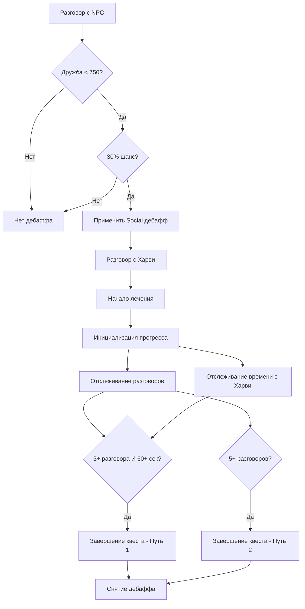

# 📊 Анализ логики социальной тревожности HarveyStressMeter

## 📋 Обзор

Данный документ содержит детальный анализ логики получения дебаффа социальной тревожности и её лечения в моде HarveyStressMeter. Проведена проверка всех этапов: от получения дебаффа до завершения квеста лечения.

---

## 🔍 Анализ компонентов системы

### 1. Получение дебаффа социальной тревожности

**Файл:** `ModEntry.cs`  
**Метод:** `CheckSocialStressTrigger` (строки 1015-1032)

```csharp
private void CheckSocialStressTrigger(NPC npc)
{
    if (Game1.stats.DaysPlayed < 5) return;
    if (_stateService.HasActiveBuffInGame(BuffIds.Social)) return;
    if (_stateService.HasActiveBuffInGame(BuffIds.Immunity)) return;

    // Проверяем дружбу с NPC
    if (Game1.player.friendshipData.TryGetValue(npc.Name, out var friendship))
    {
        // Если дружба < 750 (менее 3 сердец) и случайность 30%
        if (friendship.Points < 750 && Game1.random.NextDouble() < 0.3)
        {
            _treatmentService.ApplyStressBuff(BuffIds.Social, "Социальный дискомфорт");
            Monitor.Log($"[Social Stress] Триггер активирован при разговоре с {npc.Name} (дружба: {friendship.Points}/750)", LogLevel.Info);
        }
    }
}
```

**✅ Статус:** Корректно реализовано

**Условия срабатывания:**
- Игрок играет минимум 5 дней
- Дебафф социальной тревожности не активен
- Нет иммунитета к стрессу
- Дружба с NPC < 750 очков (менее 3 сердец)
- 30% шанс получения дебаффа

---

### 2. Начало лечения

**Файл:** `TreatmentService.cs`  
**Метод:** `StartTreatment` (строки 101-184)

```csharp
public void StartTreatment(string buffId, string displayName)
{
    // Проверки валидности
    if (!BuffToQuest.TryGetValue(buffId, out var questId)) return;
    if (!_data.StressState.HasActiveBuff(buffId)) return;
    if (_data.StressState.HasActiveQuest(questId)) return;

    // Удаление топика стресса
    if (BuffToStressTopic.TryGetValue(buffId, out var stressTopic))
    {
        if (ConversationHelper.HasTopic(stressTopic.topic))
            ConversationHelper.RemoveTopic(stressTopic.topic);
    }

    // Делегирование в StateService
    _stateService.StartTreatment(buffId, questId);

    // Инициализация прогресса для Social квеста
    _stateService.UpdateProgress(questId, progress =>
    {
        if (buffId == BuffIds.Social)
        {
            progress.TalkedUniqueToday = _data.TalkedNpcsToday.Count;  // База
            progress.SocialTalksAfterQuest = 0;                       // Счетчик
            progress.SecondsNearHarvey = 0;                           // Время с Харви
        }
    });
}
```

**✅ Статус:** Корректно реализовано

**Ключевые особенности:**
- Правильная инициализация базового значения разговоров
- Обнуление счетчиков прогресса
- Проверка на дублирование квестов

---

### 3. Подсчет прогресса лечения

**Файл:** `ModEntry.cs`  
**Метод:** `UpdateSocialQuestProgress` (строки 1057-1114)

```csharp
private void UpdateSocialQuestProgress()
{
    if (!_data.StressState.HasActiveQuest(QuestIds.Social)) return;

    var socialTreatment = GetTreatmentByQuest(QuestIds.Social);
    if (socialTreatment?.Progress == null) return;

    // Расчет разговоров ПОСЛЕ получения квеста
    int baseConversations = socialTreatment.Progress.TalkedUniqueToday;
    int currentTotal = _data.TalkedNpcsToday.Count;
    int conversationsAfterQuest = Math.Max(0, currentTotal - baseConversations);

    // Обновление при изменении
    bool conversationsChanged = socialTreatment.Progress.SocialTalksAfterQuest != conversationsAfterQuest;
    if (conversationsChanged)
    {
        socialTreatment.Progress.SocialTalksAfterQuest = conversationsAfterQuest;
        _triggerService?.UpdateQuestDescription(socialTreatment.Progress);
        
        if (conversationsAfterQuest <= 5)
        {
            Game1.addHUDMessage(new HUDMessage($"Прогресс: {conversationsAfterQuest}/5 разговоров", HUDMessage.newQuest_type));
        }
        
        SaveData();
    }
}
```

**✅ Статус:** Корректно реализовано

**Алгоритм подсчета:**
- `TalkedUniqueToday` = базовое количество разговоров при получении квеста
- `SocialTalksAfterQuest` = текущее общее количество - базовое количество
- Обновление только при изменении счетчика

---

### 4. Завершение квеста

**Файл:** `TriggerService.cs`  
**Метод:** `CheckQuestCompletion` (строки 395-418)

```csharp
public void CheckQuestCompletion(TreatmentProgress progress)
{
    int conversationsAfterQuest = progress.SocialTalksAfterQuest;
    int timeWithHarvey = progress.SecondsNearHarvey;

    // Путь 1: 3 разговора + 60 сек с Харви
    if (conversationsAfterQuest >= 3 && timeWithHarvey >= 60)
    {
        Game1.addHUDMessage(new HUDMessage("✅ Социальная тренировка завершена! (3 разговора + время с Харви)", HUDMessage.achievement_type));
        _treatmentService.CompleteTreatment(BuffIds.Social, "Социальный дискомфорт прошел! Ты отлично справилась с тренировкой.");
        return; // Предотвращение двойного срабатывания
    }

    // Путь 2: 5 разговоров
    if (conversationsAfterQuest >= 5)
    {
        Game1.addHUDMessage(new HUDMessage("✅ Социальная тренировка завершена! (5 разговоров)", HUDMessage.achievement_type));
        _treatmentService.CompleteTreatment(BuffIds.Social, "Социальный дискомфорт прошел! Ты стала увереннее в общении.");
    }
}
```

**✅ Статус:** Корректно реализовано

**Условия завершения:**
- **Путь 1:** 3+ разговора И 60+ секунд рядом с Харви
- **Путь 2:** 5+ разговоров (альтернативный путь)

---

## ⚠️ Найденные проблемы

### 1. Дублирование проверок завершения квеста

**Проблема:** Метод `CheckQuestCompletion` вызывается дважды:
- В `UpdateHarveyTimeProgress` (строка 296)
- В `UpdateSocialAnxietyProgress` (строка 280)

**Риск:** Потенциальное двойное завершение квеста или избыточные вызовы.

**Решение:** Убрать вызов из `UpdateHarveyTimeProgress`.

### 2. Потенциальная перезапись прогресса

**Проблема:** При повторном начале лечения существующий прогресс может быть перезаписан.

**Риск:** Потеря накопленного прогресса игрока.

**Решение:** Добавить проверку на существующий прогресс перед инициализацией.

### 3. Избыточные HUD уведомления

**Проблема:** Уведомления о времени с Харви показываются при каждом обновлении.

**Риск:** Спам уведомлениями в интерфейсе.

**Решение:** Добавить флаг для отслеживания показанных уведомлений.

---

## 🔧 Рекомендации по исправлению

### Исправление 1: Убрать дублирование проверок

```csharp
// В TriggerService.cs, метод UpdateHarveyTimeProgress
private bool UpdateHarveyTimeProgress(TreatmentProgress progress, bool harveyNearby)
{
    if (!harveyNearby) return false;

    progress.SecondsNearHarvey++;
    UpdateQuestDescription(progress);
    
    // ❌ УБРАТЬ: CheckQuestCompletion(progress); // Дублирует проверку
    
    // HUD уведомления...
    return false;
}
```

### Исправление 2: Защита от перезаписи прогресса

```csharp
// В TreatmentService.cs, метод StartTreatment
_stateService.UpdateProgress(questId, progress =>
{
    if (buffId == BuffIds.Social)
    {
        // ✅ ДОБАВИТЬ: Проверка на существующий прогресс
        if (progress.TalkedUniqueToday == 0 && progress.SocialTalksAfterQuest == 0 && progress.SecondsNearHarvey == 0)
        {
            progress.TalkedUniqueToday = _data.TalkedNpcsToday.Count;
            progress.SocialTalksAfterQuest = 0;
            progress.SecondsNearHarvey = 0;
        }
        else
        {
            _monitor.Log($"[StartTreatment] Прогресс Social уже инициализирован, пропускаем", LogLevel.Debug);
        }
    }
});
```

### Исправление 3: Оптимизация уведомлений

```csharp
// В TreatmentProgress.cs добавить поле:
public bool HarveyTimeNotificationsShown { get; set; } = false;

// В UpdateHarveyTimeProgress:
if (!progress.HarveyTimeNotificationsShown)
{
    switch (progress.SecondsNearHarvey)
    {
        case 15:
        case 30:
        case 45:
        case 60:
            // Показать уведомление
            progress.HarveyTimeNotificationsShown = true;
            break;
    }
}
```

---

## 📊 Схема работы системы



---

## 🎯 Заключение

### ✅ Что работает корректно:
- Получение дебаффа при разговоре с малознакомыми NPC
- Начало лечения через диалог с Харви
- Правильный подсчет разговоров после получения квеста
- Два пути завершения квеста (3+ разговора + время с Харви ИЛИ 5+ разговоров)
- Предотвращение двойного срабатывания через `return`

### ⚠️ Требует внимания:
- Дублирование проверок завершения квеста
- Потенциальная перезапись существующего прогресса
- Избыточные HUD уведомления

### 🔧 Приоритет исправлений:
1. **Высокий:** Убрать дублирование проверок завершения
2. **Средний:** Защита от перезаписи прогресса
3. **Низкий:** Оптимизация уведомлений

**Общая оценка:** Система работает стабильно, но требует мелких доработок для повышения надежности.

---

*Документ создан: {{date}}*  
*Версия мода: HarveyStressMeter*  
*Статус анализа: Завершен*
