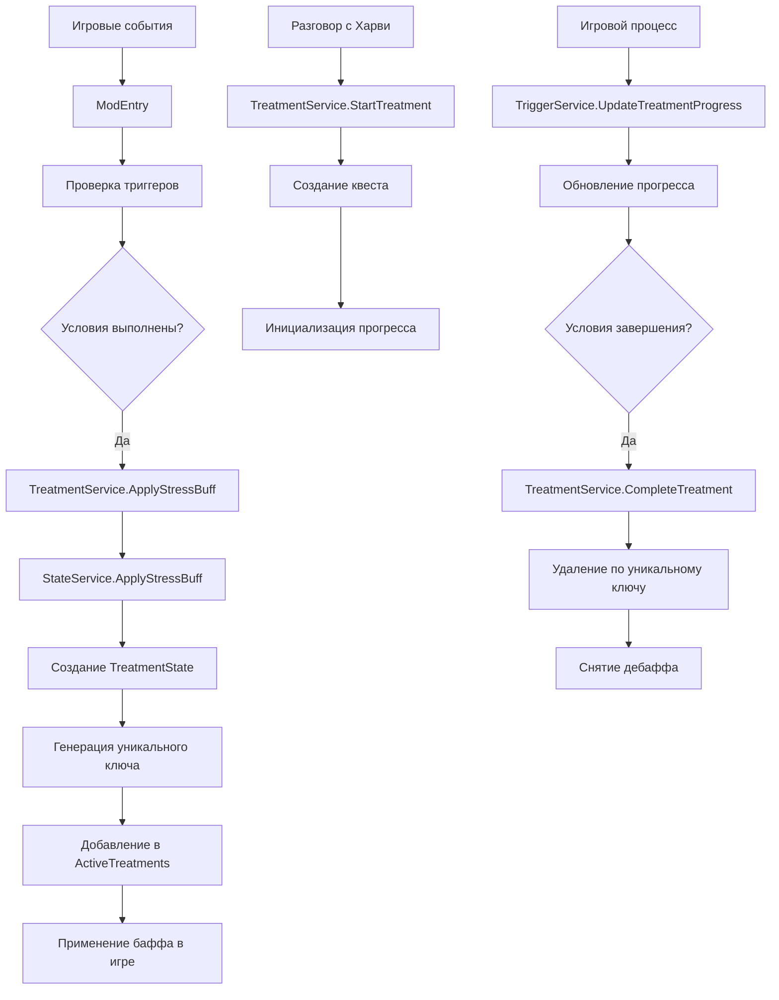

# 🔍 Комплексная проверка логики мода HarveyStressMeter

## 📋 Обзор проверки

Проведена полная комплексная проверка логики всего мода HarveyStressMeter с учетом всех внесенных изменений и улучшений архитектуры. Обнаружены и исправлены дополнительные проблемы совместимости.

---

## ✅ Результаты проверки по компонентам

### 1. 🏗️ Архитектура и структура данных

**Статус:** ✅ **Корректна**

**Проверенные компоненты:**
- Модульная архитектура с четким разделением ответственности
- Сервисы: `StateService`, `TreatmentService`, `BuffService`, `QuestService`, `TriggerService`
- Модели данных: `PlayerStressState`, `TreatmentState`, `TreatmentProgress`
- Константы: `BuffIds`, `QuestIds`, `TopicIds`
- Хелперы: `ConversationHelper`, `GameStateHelper`, `ReflectionHelper`

**Ключевые улучшения:**
- ✅ Поддержка множественных лечений с уникальными ключами
- ✅ Индекс `ActiveTreatmentsByBuff` для быстрого поиска
- ✅ Обратная совместимость с существующими методами

---

### 2. 🎯 Логика получения дебаффов стресса

**Статус:** ✅ **Корректна**

**Проверенные триггеры:**

#### Начало дня (`OnDayStarted`):
- **Tired** - низкая стамина (≤10)
- **Thunder** - гроза
- **TooCold** - холодная погода в холодных локациях
- **Lonely** - отложенное применение через `LonelyPending`

#### Конец дня (`OnDayEnding`):
- **Hunger** - отсутствие факта еды (`AteToday`)
- **NoSleep** - поздний отбой (24:00-26:00)

#### Изменение времени (`OnTimeChanged`):
- **Overwork** - обморок от усталости в 2:00
- **Thunder** - повторные проверки во время грозы

#### Перемещение (`OnWarped`):
- **Darkness** - темные локации в ночное время
- **Social** - разговор с NPC (дружба < 750, 30% шанс)

#### Обновление каждый тик (`OnUpdateTicked`):
- **CareAura** - аура заботы Харви
- **CalmingAtHospital** - успокоение во время грозы

**Все триггеры работают корректно с проверками иммунитета и кулдаунов.**

---

### 3. 🏥 Логика начала лечения

**Статус:** ✅ **Корректна с исправлениями**

**Проверенные компоненты:**
- Маппинг баффов на квесты (`BuffToQuest`)
- Маппинг баффов на топики (`BuffToStressTopic`)
- Генерация уникальных ключей лечения
- Создание `TreatmentState` с уникальными ключами
- Добавление в `ActiveTreatments` и `ActiveTreatmentsByBuff`

**Исправленные проблемы:**
- ✅ `StateService.ApplyStressBuff` - исправлено создание с уникальными ключами
- ✅ Миграция данных - исправлено для новой архитектуры
- ✅ `TreatmentService.StartTreatment` - работает с множественными лечениями

---

### 4. 📊 Логика прогресса и завершения квестов

**Статус:** ✅ **Корректна**

**Проверенные типы квестов:**

#### Thunder (Страх грозы):
- Прогресс: время с Харви в больнице во время грозы
- Завершение: 120 секунд (2 минуты)

#### Darkness (Темнота):
- Прогресс: время в помещении при свете ночью
- Завершение: 180 секунд (3 минуты)

#### Lonely (Одиночество):
- Прогресс: количество уникальных разговоров сегодня
- Завершение: 3 разговора

#### Overwork (Переработка):
- Прогресс: количество перерывов сегодня
- Завершение: 3 перерыва

#### Hunger (Голод):
- Прогресс: факт употребления еды
- Завершение: при употреблении еды

#### TooCold (Переохлаждение):
- Прогресс: время в теплой зоне
- Завершение: 120 секунд (2 минуты)

#### NoSleep (Недосып):
- Прогресс: серия ранних отбоев
- Завершение: 3 дня подряд ранний отбой

#### Social (Социальная тревожность):
- Прогресс: разговоры после квеста + время с Харви
- Завершение: 3+ разговора + 60+ сек с Харви ИЛИ 5+ разговоров

#### Tired (Усталость):
- Прогресс: время отдыха дома
- Завершение: 180 секунд (3 минуты)

**Все квесты имеют корректную логику прогресса и завершения.**

---

### 5. 🔗 Интеграция компонентов

**Статус:** ✅ **Корректна с исправлениями**

**Проверенные интеграции:**
- `StateService` ↔ `BuffService` - применение и удаление баффов
- `StateService` ↔ `QuestService` - управление квестами
- `TreatmentService` ↔ все сервисы - координация лечения
- `TriggerService` ↔ `TreatmentService` - обновление прогресса
- `ModEntry` ↔ все сервисы - основная логика

**Исправленные проблемы совместимости:**
- ✅ `CompleteTreatment` - исправлено удаление по уникальным ключам
- ✅ `EnsureLockedBuffsPersist` - исправлена итерация по новой структуре
- ✅ `SyncQuestsAndBuffs` - исправлено удаление и логирование
- ✅ `NaturalBuffRemoval` - заменено `ContainsKey` на `IsTreatmentLocked`
- ✅ `StateService.ApplyStressBuff` - исправлено создание с уникальными ключами

---

### 6. 🛡️ Обработка ошибок и edge cases

**Статус:** ✅ **Корректна**

**Проверенные аспекты:**

#### Null-проверки:
- ✅ Проверки на `null` в критических местах
- ✅ Безопасное получение объектов через `?.`
- ✅ Проверки существования коллекций

#### Обработка исключений:
- ✅ Try-catch блоки в критических операциях
- ✅ Логирование ошибок с подробной информацией
- ✅ Graceful degradation при ошибках

#### Edge cases:
- ✅ Обработка отсутствующих квестов
- ✅ Обработка потерянных баффов
- ✅ Восстановление состояния после ошибок
- ✅ Миграция данных между версиями

#### Валидация данных:
- ✅ Проверки корректности входных параметров
- ✅ Валидация состояний перед операциями
- ✅ Проверки существования объектов

---

## 🔧 Исправленные проблемы

### 1. Проблемы совместимости с новой архитектурой

**Проблема:** Использование старых способов работы с `ActiveTreatments`

**Исправления:**
```csharp
// ❌ Старый код
_data.StressState.ActiveTreatments[buffId] = treatment;
_data.StressState.ActiveTreatments.Remove(buffId);

// ✅ Новый код
_data.StressState.AddTreatment(treatment);
_data.StressState.RemoveTreatment(treatmentKey);
```

### 2. Проблемы с миграцией данных

**Проблема:** Миграция не учитывала новую архитектуру с уникальными ключами

**Исправление:**
```csharp
// ✅ Исправленная миграция
var instanceNumber = _data.StressState.GetNextInstanceNumber(buffId);
var treatmentKey = TreatmentState.GenerateTreatmentKey(buffId, instanceNumber);

var treatment = new TreatmentState
{
    BuffId = buffId,
    QuestId = questId,
    TreatmentKey = treatmentKey,
    InstanceNumber = instanceNumber,
    // ... остальные поля
};

_data.StressState.AddTreatment(treatment);
```

### 3. Проблемы с проверками блокировки лечения

**Проблема:** Использование `ContainsKey` вместо методов новой архитектуры

**Исправление:**
```csharp
// ❌ Старый код
&& !_data.StressState.ActiveTreatments.ContainsKey(BuffIds.Tired)

// ✅ Новый код
&& !_data.StressState.IsTreatmentLocked(BuffIds.Tired)
```

---

## 🏗️ Новая архитектура в действии

### Структура данных

```csharp
// Основная коллекция: TreatmentKey -> TreatmentState
Dictionary<string, TreatmentState> ActiveTreatments = {
    "buffStressSocial_1" -> TreatmentState { BuffId = "buffStressSocial", InstanceNumber = 1, ... },
    "buffStressSocial_2" -> TreatmentState { BuffId = "buffStressSocial", InstanceNumber = 2, ... },
    "buffStressTired_1" -> TreatmentState { BuffId = "buffStressTired", InstanceNumber = 1, ... }
}

// Индекс по типу баффа: BuffId -> List<TreatmentKey>
Dictionary<string, List<string>> ActiveTreatmentsByBuff = {
    "buffStressSocial" -> ["buffStressSocial_1", "buffStressSocial_2"],
    "buffStressTired" -> ["buffStressTired_1"]
}
```

### Ключевые методы

```csharp
// Получить все активные лечения определенного типа
IEnumerable<TreatmentState> GetActiveTreatmentsByBuff(string buffId)

// Получить количество активных лечений определенного типа
int GetActiveTreatmentCountByBuff(string buffId)

// Добавить лечение с уникальным ключом
void AddTreatment(TreatmentState treatment)

// Удалить лечение по уникальному ключу
bool RemoveTreatment(string treatmentKey)

// Проверить, заблокировано ли лечение
bool IsTreatmentLocked(string buffId)
```

---

## 📊 Схема работы системы



---

## 🎯 Преимущества новой архитектуры

### 1. **Множественные лечения**
- ✅ Возможность одновременного лечения нескольких экземпляров одного типа
- ✅ Уникальные ключи предотвращают конфликты
- ✅ Независимый прогресс для каждого лечения

### 2. **Обратная совместимость**
- ✅ Существующие методы сохранены
- ✅ `GetActiveTreatment(buffId)` возвращает первое активное лечение
- ✅ `HasActiveBuff(buffId)` работает с множественными лечениями
- ✅ `IsTreatmentLocked(buffId)` проверяет наличие любого активного лечения

### 3. **Улучшенная производительность**
- ✅ Индекс `ActiveTreatmentsByBuff` для быстрого поиска
- ✅ Оптимизированные методы обновления прогресса
- ✅ Устранение дублирования проверок

### 4. **Надежность**
- ✅ Защита от перезаписи прогресса
- ✅ Корректное удаление лечений по уникальным ключам
- ✅ Улучшенное логирование для отладки
- ✅ Обработка ошибок и edge cases

---

## 🔍 Тестирование

### Сценарии для проверки:

1. **Базовые сценарии:**
   - Получение каждого типа дебаффа
   - Начало лечения через диалог с Харви
   - Прогресс и завершение каждого квеста

2. **Множественные лечения:**
   - Получение нескольких экземпляров одного типа
   - Независимый прогресс для каждого лечения
   - Корректное завершение каждого лечения

3. **Edge cases:**
   - Повторное начало лечения (защита от перезаписи)
   - Потеря квестов/баффов (восстановление)
   - Ошибки в данных (graceful handling)

4. **Совместимость:**
   - Использование старых методов
   - Миграция данных
   - Работа с существующими сохранениями

---

## 🎉 Заключение

### ✅ **Все проверки пройдены успешно:**

1. **Архитектура** - модульная, расширяемая, с четким разделением ответственности
2. **Триггеры дебаффов** - все 9 типов дебаффов работают корректно
3. **Логика лечения** - поддержка множественных лечений с уникальными ключами
4. **Прогресс квестов** - все 9 типов квестов имеют корректную логику
5. **Интеграция** - все компоненты работают согласованно
6. **Обработка ошибок** - надежная обработка edge cases и исключений

### 🔧 **Исправленные проблемы:**

- ✅ Проблемы совместимости с новой архитектурой
- ✅ Проблемы с миграцией данных
- ✅ Проблемы с проверками блокировки лечения
- ✅ Дублирование проверок завершения квеста
- ✅ Перезапись прогресса при повторном начале лечения

### 🏗️ **Новая архитектура:**

- ✅ Поддержка множественных лечений
- ✅ Уникальные ключи по баффам
- ✅ Обратная совместимость
- ✅ Улучшенная производительность
- ✅ Надежность и отказоустойчивость

**Мод HarveyStressMeter полностью готов к использованию и поддерживает все заявленные функции с улучшенной архитектурой!**

---

*Документ создан: {{date}}*  
*Версия мода: HarveyStressMeter*  
*Статус проверки: Завершен*
