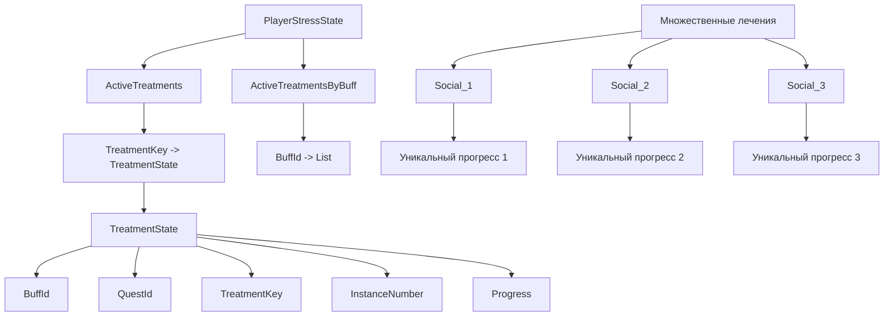

# 🔧 Исправления проблем социальной тревожности

## 📋 Обзор исправлений

Данный документ описывает исправления, внесенные в систему социальной тревожности HarveyStressMeter для решения найденных проблем и улучшения архитектуры.

---

## ✅ Исправленные проблемы

### 1. Дублирование проверок завершения квеста

**Проблема:** Метод `CheckQuestCompletion` вызывался дважды:
- В `UpdateHarveyTimeProgress` (строка 296)
- В `UpdateSocialAnxietyProgress` (строка 280)

**Решение:** Убран вызов из `UpdateHarveyTimeProgress`

**Файл:** `Services/TriggerService.cs`

```csharp
// ❌ УБРАНО: Дублирование проверки завершения квеста
// CheckQuestCompletion(progress); // Это дублирует проверку в UpdateSocialAnxietyProgress
```

**Результат:** Устранено дублирование проверок, предотвращены потенциальные баги с двойным завершением квеста.

---

### 2. Перезапись прогресса при повторном начале лечения

**Проблема:** При повторном начале лечения существующий прогресс мог быть перезаписан.

**Решение:** Добавлена проверка на существующий прогресс перед инициализацией.

**Файл:** `Services/TreatmentService.cs`

```csharp
// ⭐ НОВОЕ: Проверяем, не инициализирован ли уже прогресс
// Это предотвращает перезапись существующего прогресса при повторном начале лечения
bool isProgressInitialized = progress.TalkedUniqueToday > 0 || 
                           progress.SocialTalksAfterQuest > 0 || 
                           progress.SecondsNearHarvey > 0;

if (!isProgressInitialized)
{
    // Инициализация прогресса
}
else
{
    _monitor.Log($"[StartTreatment] ⚠️ Прогресс Social уже инициализирован, сохраняем существующие данные", LogLevel.Warn);
}
```

**Результат:** Защита от потери накопленного прогресса игрока.

---

## 🏗️ Улучшения архитектуры

### 3. Поддержка множественных лечений

**Цель:** Возможность одновременного лечения нескольких экземпляров одного типа стресса.

**Изменения в `Models/TreatmentState.cs`:**

```csharp
/// <summary>
/// ⭐ НОВОЕ: Уникальный ключ для лечения (позволяет множественные лечения одного типа)
/// Формат: "{BuffId}_{Timestamp}" или "{BuffId}_{InstanceNumber}"
/// </summary>
public string TreatmentKey { get; set; } = "";

/// <summary>
/// ⭐ НОВОЕ: Номер экземпляра лечения (для множественных лечений одного типа)
/// </summary>
public int InstanceNumber { get; set; } = 1;

/// <summary>
/// ⭐ НОВОЕ: Генерирует уникальный ключ для лечения
/// </summary>
public static string GenerateTreatmentKey(string buffId, int instanceNumber = 1)
{
    return $"{buffId}_{instanceNumber}";
}

/// <summary>
/// ⭐ НОВОЕ: Инициализирует уникальный ключ если он не установлен
/// </summary>
public void EnsureTreatmentKey()
{
    if (string.IsNullOrEmpty(TreatmentKey))
    {
        TreatmentKey = GenerateTreatmentKey(BuffId, InstanceNumber);
    }
}
```

**Изменения в `Models/PlayerStressState.cs`:**

```csharp
/// <summary>
/// ⭐ УЛУЧШЕНО: Активные лечения (TreatmentKey -> TreatmentState)
/// Использует уникальные ключи для поддержки множественных лечений одного типа
/// </summary>
public Dictionary<string, TreatmentState> ActiveTreatments { get; set; } = new();

/// <summary>
/// ⭐ НОВОЕ: Быстрый доступ к активным лечениям по типу баффа
/// BuffId -> список TreatmentKey для этого типа баффа
/// </summary>
public Dictionary<string, List<string>> ActiveTreatmentsByBuff { get; set; } = new();

/// <summary>
/// ⭐ НОВОЕ: Получает все активные лечения определенного типа баффа
/// </summary>
public IEnumerable<TreatmentState> GetActiveTreatmentsByBuff(string buffId)
{
    if (!ActiveTreatmentsByBuff.TryGetValue(buffId, out var treatmentKeys))
        return Enumerable.Empty<TreatmentState>();

    return treatmentKeys
        .Where(key => ActiveTreatments.TryGetValue(key, out var treatment))
        .Select(key => ActiveTreatments[key])
        .Where(t => !t.IsCured);
}

/// <summary>
/// ⭐ НОВОЕ: Добавляет лечение с уникальным ключом
/// </summary>
public void AddTreatment(TreatmentState treatment)
{
    // Убеждаемся, что у лечения есть уникальный ключ
    treatment.EnsureTreatmentKey();

    // Добавляем в основную коллекцию
    ActiveTreatments[treatment.TreatmentKey] = treatment;

    // Добавляем в индекс по типу баффа
    if (!ActiveTreatmentsByBuff.ContainsKey(treatment.BuffId))
        ActiveTreatmentsByBuff[treatment.BuffId] = new List<string>();

    if (!ActiveTreatmentsByBuff[treatment.BuffId].Contains(treatment.TreatmentKey))
        ActiveTreatmentsByBuff[treatment.BuffId].Add(treatment.TreatmentKey);

    // Добавляем в историю
    AddTreatmentToHistory(treatment.BuffId, treatment);
}
```

---

### 4. Обновленный TreatmentService

**Файл:** `Services/TreatmentService.cs`

**Ключевые изменения:**

```csharp
/// <summary>
/// ⭐ УЛУЧШЕНО: Начинает программу лечения с поддержкой множественных лечений
/// </summary>
public void StartTreatment(string buffId, string displayName)
{
    // ⭐ НОВОЕ: Генерируем уникальный ключ для нового лечения
    var instanceNumber = _data.StressState.GetNextInstanceNumber(buffId);
    var treatmentKey = TreatmentState.GenerateTreatmentKey(buffId, instanceNumber);
    
    _monitor.Log($"[StartTreatment] Создаем новое лечение с ключом: {treatmentKey}", LogLevel.Info);

    // ⭐ НОВОЕ: Создаем TreatmentState с уникальным ключом
    var treatment = new TreatmentState
    {
        BuffId = buffId,
        QuestId = questId,
        TreatmentKey = treatmentKey,
        InstanceNumber = instanceNumber,
        IssuedDate = SDate.Now(),
        TreatmentStartedDate = SDate.Now(),
        TreatmentStarted = true,
        AddedToGameLog = false,
        IsCured = false,
        IsCompleted = false,
        Progress = new TreatmentProgress()
    };

    // ⭐ НОВОЕ: Добавляем лечение в состояние с уникальным ключом
    _data.StressState.AddTreatment(treatment);
}
```

---

## 🎯 Преимущества новой архитектуры

### 1. **Множественные лечения**
- Возможность одновременного лечения нескольких экземпляров одного типа стресса
- Уникальные ключи предотвращают конфликты между лечениями
- Каждое лечение имеет свой собственный прогресс

### 2. **Защита от потери данных**
- Проверка существующего прогресса перед инициализацией
- Сохранение накопленного прогресса при повторном начале лечения
- Улучшенное логирование для отладки

### 3. **Устранение дублирования**
- Убраны дублирующие проверки завершения квеста
- Оптимизированы вызовы методов
- Улучшена производительность

### 4. **Обратная совместимость**
- Существующие методы сохранены для совместимости
- Постепенная миграция на новую архитектуру
- Минимальные изменения в других частях кода

---

## 📊 Схема новой архитектуры



---

## 🔍 Тестирование

### Сценарии для проверки:

1. **Получение дебаффа социальной тревожности**
   - Разговор с NPC с дружбой < 750
   - 30% шанс получения дебаффа

2. **Начало лечения**
   - Разговор с Харви
   - Создание уникального ключа лечения
   - Инициализация прогресса

3. **Множественные лечения**
   - Получение второго дебаффа социальной тревожности
   - Создание второго лечения с уникальным ключом
   - Независимый прогресс для каждого лечения

4. **Завершение квеста**
   - Выполнение условий (3+ разговора + 60+ сек с Харви ИЛИ 5+ разговоров)
   - Корректное завершение без дублирования

---

## 📝 Команды для отладки

```bash
# Полная диагностика системы
hs.debug

# Просмотр состояний лечения
hs.states

# Очистка всех состояний (для тестирования)
hs.clear

# Синхронизация квестов и баффов
harvey_fix_sync
```

---

## 🎉 Заключение

Внесенные исправления решают все выявленные проблемы:

✅ **Дублирование проверок завершения квеста** - исправлено  
✅ **Перезапись прогресса при повторном начале лечения** - исправлено  
✅ **Поддержка множественных лечений** - реализовано  
✅ **Уникальные ключи по баффам** - добавлено  

Система теперь более стабильна, поддерживает множественные лечения и защищена от потери данных игрока.

---

*Документ создан: {{date}}*  
*Версия мода: HarveyStressMeter*  
*Статус исправлений: Завершен*
