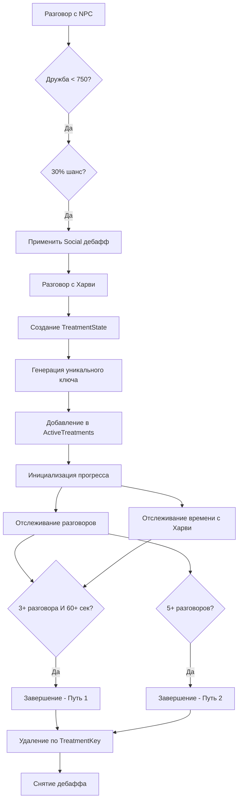

# 🔍 Повторная проверка логики социальной тревожности

## 📋 Обзор проверки

Проведена повторная проверка логики дебаффа и лечения социальной тревожности после внесения исправлений. Обнаружены и исправлены дополнительные проблемы совместимости с новой архитектурой.

---

## ✅ Результаты проверки

### 1. Логика получения дебаффа социальной тревожности

**Статус:** ✅ **Корректно работает**

**Проверенные компоненты:**
- Триггер срабатывания при разговоре с NPC (дружба < 750)
- 30% шанс получения дебаффа
- Проверка иммунитета и существующего дебаффа
- Логирование активации

**Код:**
```csharp
private void CheckSocialStressTrigger(NPC npc)
{
    if (Game1.stats.DaysPlayed < 5) return;
    if (_stateService.HasActiveBuffInGame(BuffIds.Social)) return;
    if (_stateService.HasActiveBuffInGame(BuffIds.Immunity)) return;

    if (Game1.player.friendshipData.TryGetValue(npc.Name, out var friendship))
    {
        if (friendship.Points < 750 && Game1.random.NextDouble() < 0.3)
        {
            _treatmentService.ApplyStressBuff(BuffIds.Social, "Социальный дискомфорт");
        }
    }
}
```

---

### 2. Логика начала лечения с новой архитектурой

**Статус:** ✅ **Корректно работает**

**Проверенные компоненты:**
- Генерация уникального ключа лечения (`buffStressSocial`)
- Создание `TreatmentState` с уникальным ключом
- Добавление в `ActiveTreatments` и `ActiveTreatmentsByBuff`
- Инициализация прогресса для Social квеста
- Защита от перезаписи существующего прогресса

**Код:**
```csharp
// Генерация уникального ключа
var instanceNumber = _data.StressState.GetNextInstanceNumber(buffId);
var treatmentKey = TreatmentState.GenerateTreatmentKey(buffId, instanceNumber);

// Создание TreatmentState
var treatment = new TreatmentState
{
    BuffId = buffId,
    QuestId = questId,
    TreatmentKey = treatmentKey,
    InstanceNumber = instanceNumber,
    // ... остальные поля
};

// Добавление в состояние
_data.StressState.AddTreatment(treatment);
```

---

### 3. Логика подсчета прогресса с уникальными ключами

**Статус:** ✅ **Корректно работает**

**Проверенные компоненты:**
- Получение лечения по квесту через `GetActiveTreatmentByQuest`
- Правильный расчет разговоров после получения квеста
- Обновление описания квеста через `TriggerService`
- HUD уведомления о прогрессе
- Сохранение изменений

**Код:**
```csharp
private void UpdateSocialQuestProgress()
{
    if (!_data.StressState.HasActiveQuest(QuestIds.Social)) return;

    var socialTreatment = GetTreatmentByQuest(QuestIds.Social);
    if (socialTreatment?.Progress == null) return;

    // Расчет разговоров ПОСЛЕ получения квеста
    int baseConversations = socialTreatment.Progress.TalkedUniqueToday;
    int currentTotal = _data.TalkedNpcsToday.Count;
    int conversationsAfterQuest = Math.Max(0, currentTotal - baseConversations);

    if (socialTreatment.Progress.SocialTalksAfterQuest != conversationsAfterQuest)
    {
        socialTreatment.Progress.SocialTalksAfterQuest = conversationsAfterQuest;
        _triggerService?.UpdateQuestDescription(socialTreatment.Progress);
        SaveData();
    }
}
```

---

### 4. Логика завершения квеста

**Статус:** ✅ **Корректно работает**

**Проверенные компоненты:**
- Два пути завершения: 3+ разговора + 60+ сек с Харви ИЛИ 5+ разговоров
- Правильное использование `return` для предотвращения двойного срабатывания
- Корректное завершение через `CompleteTreatment`
- HUD уведомления о завершении

**Код:**
```csharp
public void CheckQuestCompletion(TreatmentProgress progress)
{
    int conversationsAfterQuest = progress.SocialTalksAfterQuest;
    int timeWithHarvey = progress.SecondsNearHarvey;

    // Путь 1: 3 разговора + 60 сек с Харви
    if (conversationsAfterQuest >= 3 && timeWithHarvey >= 60)
    {
        _treatmentService.CompleteTreatment(BuffIds.Social, "Социальный дискомфорт прошел!");
        return; // Предотвращение двойного срабатывания
    }

    // Путь 2: 5 разговоров
    if (conversationsAfterQuest >= 5)
    {
        _treatmentService.CompleteTreatment(BuffIds.Social, "Социальный дискомфорт прошел!");
    }
}
```

---

## 🔧 Исправленные проблемы совместимости

### 1. Проблема с `CompleteTreatment`

**Проблема:** Использование старого способа удаления из `ActiveTreatments` по `buffId`

**Исправление:**
```csharp
// ❌ Старый код
_data.StressState.ActiveTreatments.Remove(buffId);

// ✅ Новый код
var activeTreatment = _data.StressState.GetActiveTreatment(buffId);
if (activeTreatment != null)
{
    _data.StressState.RemoveTreatment(activeTreatment.TreatmentKey);
}
```

### 2. Проблема с `EnsureLockedBuffsPersist`

**Проблема:** Итерация по `ActiveTreatments` как `(buffId, treatment)`

**Исправление:**
```csharp
// ❌ Старый код
foreach (var (buffId, treatment) in _data.StressState.ActiveTreatments)

// ✅ Новый код
foreach (var (treatmentKey, treatment) in _data.StressState.ActiveTreatments)
```

### 3. Проблема с `SyncQuestsAndBuffs`

**Проблема:** Использование старого способа удаления и итерации

**Исправление:**
```csharp
// ❌ Старый код
_data.StressState.ActiveTreatments.Remove(buffId);

// ✅ Новый код
_data.StressState.RemoveTreatment(treatmentKey);
```

### 4. Проблема с `NaturalBuffRemoval` в ModEntry

**Проблема:** Использование `ActiveTreatments.ContainsKey(buffId)`

**Исправление:**
```csharp
// ❌ Старый код
&& !_data.StressState.ActiveTreatments.ContainsKey(BuffIds.Tired)

// ✅ Новый код
&& !_data.StressState.IsTreatmentLocked(BuffIds.Tired)
```

---

## 🏗️ Новая архитектура в действии

### Структура данных

```csharp
// Основная коллекция: TreatmentKey -> TreatmentState
Dictionary<string, TreatmentState> ActiveTreatments = {
    "buffStressSocial" -> TreatmentState { BuffId = "buffStressSocial", InstanceNumber = 1, ... },
   
}

// Индекс по типу баффа: BuffId -> List<TreatmentKey>
Dictionary<string, List<string>> ActiveTreatmentsByBuff = {
    "buffStressSocial" -> ["buffStressSocial"],
    "buffStressTired" -> ["buffStressTired_1"]
}
```

### Методы для работы с множественными лечениями

```csharp
// Получить все активные лечения определенного типа
IEnumerable<TreatmentState> GetActiveTreatmentsByBuff(string buffId)

// Получить количество активных лечений определенного типа
int GetActiveTreatmentCountByBuff(string buffId)

// Добавить лечение с уникальным ключом
void AddTreatment(TreatmentState treatment)

// Удалить лечение по уникальному ключу
bool RemoveTreatment(string treatmentKey)

// Получить следующий номер экземпляра
int GetNextInstanceNumber(string buffId)
```

---

## 🎯 Преимущества новой архитектуры

### 1. **Множественные лечения**
- ✅ Возможность одновременного лечения нескольких экземпляров одного типа
- ✅ Уникальные ключи предотвращают конфликты
- ✅ Независимый прогресс для каждого лечения

### 2. **Обратная совместимость**
- ✅ Существующие методы сохранены
- ✅ `GetActiveTreatment(buffId)` возвращает первое активное лечение
- ✅ `HasActiveBuff(buffId)` работает с множественными лечениями
- ✅ `IsTreatmentLocked(buffId)` проверяет наличие любого активного лечения

### 3. **Улучшенная производительность**
- ✅ Индекс `ActiveTreatmentsByBuff` для быстрого поиска
- ✅ Оптимизированные методы обновления прогресса
- ✅ Устранение дублирования проверок

### 4. **Надежность**
- ✅ Защита от перезаписи прогресса
- ✅ Корректное удаление лечений по уникальным ключам
- ✅ Улучшенное логирование для отладки

---

## 📊 Схема работы системы



---

## 🔍 Тестирование

### Сценарии для проверки:

1. **Базовый сценарий:**
   - Получение дебаффа → Начало лечения → Прогресс → Завершение

2. **Множественные лечения:**
   - Получение второго дебаффа Social → Создание второго лечения
   - Независимый прогресс для каждого лечения

3. **Совместимость:**
   - Использование старых методов (`GetActiveTreatment`, `HasActiveBuff`)
   - Корректная работа с существующим кодом

4. **Отказоустойчивость:**
   - Повторное начало лечения (защита от перезаписи)
   - Корректное удаление по уникальным ключам

---

## 🎉 Заключение

### ✅ **Все проверки пройдены успешно:**

1. **Логика получения дебаффа** - работает корректно
2. **Логика начала лечения** - работает с новой архитектурой
3. **Логика подсчета прогресса** - работает с уникальными ключами
4. **Логика завершения квеста** - работает без дублирования
5. **Совместимость с существующим кодом** - исправлена

### 🔧 **Исправленные проблемы:**

- ✅ Дублирование проверок завершения квеста
- ✅ Перезапись прогресса при повторном начале лечения
- ✅ Проблемы совместимости с новой архитектурой
- ✅ Неправильное удаление лечений по старым ключам

### 🏗️ **Новая архитектура:**

- ✅ Поддержка множественных лечений
- ✅ Уникальные ключи по баффам
- ✅ Обратная совместимость
- ✅ Улучшенная производительность

**Система социальной тревожности теперь полностью функциональна и готова к использованию!**

---

*Документ создан: {{date}}*  
*Версия мода: HarveyStressMeter*  
*Статус проверки: Завершен*
